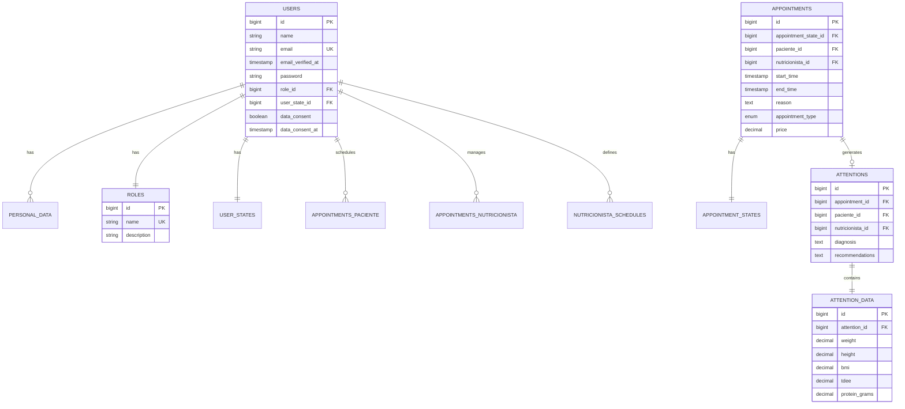

## Overview

NutriFit's database is designed using **Laravel migrations** for version control and portability. The schema supports:

- Multi-role user management (Admin, Nutritionist, Patient)
- Appointment scheduling with state tracking
- Detailed medical attention records with anthropometric data
- Queue system for asynchronous tasks
- Session management and authentication

**Database Support**:
- **Development**: SQLite (embedded, no configuration)
- **Production**: MySQL 8.0+ (recommended)

## Entity Relationship Diagram



## Core Tables

### users

**Purpose**: Core user accounts for all system roles

**Location**: `database/migrations/2025_10_28_193453_create_users_table.php`

| Column | Type | Constraints | Description |
|--------|------|-------------|-------------|
| `id` | bigint | PRIMARY KEY | Auto-incrementing user ID |
| `name` | string | NOT NULL | Full name of the user |
| `email` | string | UNIQUE, NOT NULL | Email address (login credential) |
| `email_verified_at` | timestamp | NULL | Verification timestamp |
| `password` | string | NOT NULL | Hashed password (bcrypt) |
| `role_id` | bigint | FK → roles, DEFAULT 3 | User role (1=admin, 2=nutritionist, 3=patient) |
| `user_state_id` | bigint | FK → user_states, DEFAULT 1 | Account status (1=active, 2=inactive) |
| `data_consent` | boolean | DEFAULT false | GDPR/LOPD consent flag |
| `data_consent_at` | timestamp | NULL | When consent was given |
| `two_factor_secret` | text | NULL | 2FA secret key |
| `two_factor_recovery_codes` | text | NULL | 2FA backup codes |
| `remember_token` | string(100) | NULL | "Remember me" token |
| `created_at` | timestamp | AUTO | Account creation |
| `updated_at` | timestamp | AUTO | Last update |

**Key Relationships**:
```php
// app/Models/User.php
public function role(): BelongsTo
public function personalData(): HasOne
public function appointmentsAsPaciente(): HasMany
public function appointmentsAsNutricionista(): HasMany
public function attentionsAsPaciente(): HasMany
public function attentionsAsNutricionista(): HasMany
public function schedules(): HasMany
```

**Business Logic**:
```php
public function estaHabilitadoClinicamente(): bool
{
    return $this->isActive() && $this->hasVerifiedEmail();
}
```

### roles

**Purpose**: Define user access levels

**Location**: `database/migrations/2025_10_28_193452_create_roles_table.php`

| Column | Type | Constraints | Description |
|--------|------|-------------|-------------|
| `id` | bigint | PRIMARY KEY | Role ID |
| `name` | string | UNIQUE | Role identifier (administrador, nutricionista, paciente) |
| `description` | string | NULL | Human-readable description |
| `created_at` | timestamp | AUTO | |
| `updated_at` | timestamp | AUTO | |

**Seeded Roles**:
```php
[
    ['id' => 1, 'name' => 'administrador', 'description' => 'Administrator with full access'],
    ['id' => 2, 'name' => 'nutricionista', 'description' => 'Nutritionist managing appointments'],
    ['id' => 3, 'name' => 'paciente', 'description' => 'Patient with limited access'],
]
```

### user_states

**Purpose**: Track account activation status

**Location**: `database/migrations/2025_10_28_193451_create_user_states_table.php`

| Column | Type | Description |
|--------|------|-------------|
| `id` | bigint | State ID |
| `name` | string | State name (activo, inactivo) |
| `description` | string | Explanation |

**States**:
- `1` = **activo** - Can log in and use system
- `2` = **inactivo** - Account disabled by admin

### personal_data

**Purpose**: Extended profile information (1:1 with users)

**Location**: `database/migrations/2025_10_28_193605_create_personal_data_table.php`

| Column | Type | Constraints | Description |
|--------|------|-------------|-------------|
| `id` | bigint | PRIMARY KEY | |
| `user_id` | bigint | FK → users, CASCADE | Owner user |
| `cedula` | string(20) | UNIQUE, NULL | National ID (Ecuador) |
| `phone` | string(10) | NULL | Contact number |
| `address` | string | NULL | Physical address |
| `birth_date` | date | NULL | Date of birth |
| `gender` | enum | NULL | male, female, other |
| `profile_photo` | string | NULL | Storage path to photo |
| `created_at` | timestamp | AUTO | |
| `updated_at` | timestamp | AUTO | |

**Cascade Behavior**: Deleting a user automatically deletes their personal data.

## Appointment System

### appointments

**Purpose**: Schedule patient consultations with nutritionists

**Location**: `database/migrations/2025_10_28_193618_create_appointments_table.php`

| Column | Type | Constraints | Description |
|--------|------|-------------|-------------|
| `id` | bigint | PRIMARY KEY | |
| `appointment_state_id` | bigint | FK → appointment_states | Current state |
| `paciente_id` | bigint | FK → users, CASCADE | Patient |
| `nutricionista_id` | bigint | FK → users, CASCADE | Nutritionist |
| `start_time` | timestamp | NOT NULL | Appointment start |
| `end_time` | timestamp | NULL | Appointment end |
| `reason` | text | NULL | Consultation reason |
| `appointment_type` | enum | DEFAULT 'primera_vez' | primera_vez, seguimiento, control |
| `price` | decimal(8,2) | NULL | Consultation cost |
| `notes` | text | NULL | Additional notes |
| `created_at` | timestamp | AUTO | |
| `updated_at` | timestamp | AUTO | |

**Appointment Types**:
- `primera_vez` - First-time consultation
- `seguimiento` - Follow-up appointment
- `control` - Routine check-up

**State Transitions**:
```
pendiente → confirmada → completada
     ↓
  cancelada
     ↓
  vencida (expired)
```

### appointment_states

**Purpose**: Track appointment lifecycle

**Location**: `database/migrations/2025_10_28_193612_create_appointment_states_table.php`

| Column | Type | Description |
|--------|------|-------------|
| `id` | bigint | State ID |
| `name` | string | State name |
| `description` | text | Explanation |

**States**:
1. **pendiente** - Awaiting confirmation
2. **confirmada** - Confirmed by patient/nutritionist
3. **completada** - Consultation finished
4. **cancelada** - Cancelled before appointment
5. **vencida** - Expired (time passed without completion)

### nutricionista_schedules

**Purpose**: Define availability windows for nutritionists

**Location**: `database/migrations/2025_11_11_144639_create_nutricionista_schedules_table.php`

| Column | Type | Constraints | Description |
|--------|------|-------------|-------------|
| `id` | bigint | PRIMARY KEY | |
| `nutricionista_id` | bigint | FK → users, CASCADE | Nutritionist |
| `day_of_week` | tinyint | NOT NULL | 0=Sunday, 1=Monday, ..., 6=Saturday |
| `start_time` | time | NOT NULL | Opening time (e.g., 09:00:00) |
| `end_time` | time | NOT NULL | Closing time (e.g., 17:00:00) |
| `consultation_duration` | int | DEFAULT 45 | Slot duration in minutes |
| `is_active` | boolean | DEFAULT true | Enable/disable schedule |
| `created_at` | timestamp | AUTO | |
| `updated_at` | timestamp | AUTO | |

**Index**: `(nutricionista_id, day_of_week)` for fast lookups

**Usage**:
```php
// Get Monday availability for nutritionist ID 5
$schedule = NutricionistaSchedule::where('nutricionista_id', 5)
    ->where('day_of_week', 1)
    ->where('is_active', true)
    ->first();
```

## Medical Records

### attentions

**Purpose**: Document completed medical consultations

**Location**: `database/migrations/2025_10_28_193623_create_attentions_table.php`

| Column | Type | Constraints | Description |
|--------|------|-------------|-------------|
| `id` | bigint | PRIMARY KEY | |
| `appointment_id` | bigint | FK → appointments, CASCADE | Associated appointment |
| `paciente_id` | bigint | FK → users, CASCADE | Patient |
| `nutricionista_id` | bigint | FK → users, CASCADE | Attending nutritionist |
| `diagnosis` | text | NULL | Clinical diagnosis |
| `recommendations` | text | NULL | Nutritional recommendations |
| `created_at` | timestamp | AUTO | Consultation date |
| `updated_at` | timestamp | AUTO | |

**Relationship**: Each appointment can have **at most one** attention record (1:1).

### attention_data

**Purpose**: Store anthropometric measurements and nutrition calculations

**Location**: `database/migrations/2025_10_28_193629_create_attention_data_table.php`

<Tabs>
  <Tab title="Basic Measurements">
    | Column | Type | Description |
    |--------|------|-------------|
    | `weight` | decimal(5,2) | Body weight (kg) |
    | `height` | decimal(5,2) | Height (cm) |
    | `waist` | decimal(5,2) | Waist circumference (cm) |
    | `hip` | decimal(5,2) | Hip circumference (cm) |
    | `neck` | decimal(5,2) | Neck circumference (cm) |
    | `wrist` | decimal(5,2) | Wrist circumference (cm) |
    | `arm_contracted` | decimal(5,2) | Arm circumference (contracted) |
    | `arm_relaxed` | decimal(5,2) | Arm circumference (relaxed) |
    | `thigh` | decimal(5,2) | Thigh circumference (cm) |
    | `calf` | decimal(5,2) | Calf circumference (cm) |
  </Tab>
  
  <Tab title="Calculated Indices">
    | Column | Type | Description |
    |--------|------|-------------|
    | `bmi` | decimal(5,2) | Body Mass Index |
    | `body_fat` | decimal(5,2) | Body fat percentage |
    | `tmb` | decimal(6,2) | Basal Metabolic Rate (kcal) |
    | `tdee` | decimal(6,2) | Total Daily Energy Expenditure (kcal) |
    | `whr` | decimal(5,3) | Waist-to-Hip Ratio |
    | `wht` | decimal(5,3) | Waist-to-Height Ratio |
    | `frame_index` | decimal(5,2) | Frame size index (Frisancho) |
  </Tab>
  
  <Tab title="Macronutrients">
    | Column | Type | Description |
    |--------|------|-------------|
    | `target_calories` | decimal(6,2) | Daily calorie target |
    | `protein_grams` | decimal(6,2) | Protein (g/day) |
    | `fat_grams` | decimal(6,2) | Fat (g/day) |
    | `carbs_grams` | decimal(6,2) | Carbohydrates (g/day) |
    | `protein_percentage` | decimal(5,2) | Protein % of total |
    | `fat_percentage` | decimal(5,2) | Fat % of total |
    | `carbs_percentage` | decimal(5,2) | Carbs % of total |
  </Tab>
  
  <Tab title="Food Equivalents">
    | Column | Type | Description |
    |--------|------|-------------|
    | `eq_cereales` | decimal(5,2) | Cereal equivalents |
    | `eq_verduras` | decimal(5,2) | Vegetable equivalents |
    | `eq_frutas` | decimal(5,2) | Fruit equivalents |
    | `eq_lacteo` | decimal(5,2) | Dairy equivalents |
    | `eq_animal` | decimal(5,2) | Animal protein equivalents |
    | `eq_aceites` | decimal(5,2) | Oil equivalents |
    | `eq_grasas_prot` | decimal(5,2) | Protein-rich fat equivalents |
    | `eq_leguminosas` | decimal(5,2) | Legume equivalents |
    | `total_calories_equivalents` | decimal(6,2) | Total from equivalents |
  </Tab>
</Tabs>

**Activity Levels** (enum):
- `sedentary` - Little to no exercise
- `light` - Light exercise 1-3 days/week
- `moderate` - Moderate exercise 3-5 days/week
- `active` - Heavy exercise 6-7 days/week
- `very_active` - Very intense exercise + physical job

**Nutrition Goals** (enum):
- `deficit` - Weight loss (calorie deficit)
- `maintenance` - Maintain current weight
- `surplus` - Weight gain (calorie surplus)

## Queue & Job System

### jobs

**Purpose**: Store queued background tasks (email sending, notifications)

**Location**: `database/migrations/2025_10_28_193455_create_jobs_table.php`

| Column | Type | Description |
|--------|------|-------------|
| `id` | bigint | Job ID |
| `queue` | string | Queue name (default) |
| `payload` | longtext | Serialized job data |
| `attempts` | tinyint | Retry attempts |
| `reserved_at` | int | When worker picked up job |
| `available_at` | int | When job becomes available |
| `created_at` | int | Job creation time |

**Worker Command**:
```bash
php artisan queue:work
```

### failed_jobs

**Purpose**: Log jobs that failed after max retries

| Column | Type | Description |
|--------|------|-------------|
| `id` | bigint | Failed job ID |
| `uuid` | string | Unique identifier |
| `connection` | text | Queue connection |
| `queue` | text | Queue name |
| `payload` | longtext | Job data |
| `exception` | longtext | Error stack trace |
| `failed_at` | timestamp | Failure time |

**Retry Failed Jobs**:
```bash
php artisan queue:retry all
```

## Session Management

### sessions

**Purpose**: Database-backed user sessions (stateless application)

| Column | Type | Description |
|--------|------|-------------|
| `id` | string | Session ID (primary key) |
| `user_id` | bigint | Authenticated user (nullable) |
| `ip_address` | string(45) | Client IP |
| `user_agent` | text | Browser info |
| `payload` | longtext | Session data (serialized) |
| `last_activity` | int | Last activity timestamp |

**Security**: Sessions automatically cleaned up after expiration (default 120 minutes).

### password_reset_tokens

**Purpose**: Temporary tokens for password reset flow

| Column | Type | Description |
|--------|------|-------------|
| `email` | string | User email (primary key) |
| `token` | string | Hashed reset token |
| `created_at` | timestamp | Token creation time |

**Expiration**: Tokens expire after 60 minutes (configurable).

## System Configuration

### system_settings

**Purpose**: Store global system configuration (contact info, branding)

**Location**: `database/migrations/2026_01_16_192714_create_system_settings_table.php`

Used for:
- Contact form email routing
- System-wide settings
- Branding information

### nutricionista_settings

**Purpose**: Per-nutritionist preferences and configuration

**Location**: `database/migrations/2026_01_14_000000_create_nutricionista_settings_table.php`

Custom settings for individual nutritionists.

## Migration Commands

### Run Migrations
```bash
# Fresh install
php artisan migrate

# Reset and re-run all
php artisan migrate:fresh

# With seeders
php artisan migrate:fresh --seed
```

### Rollback
```bash
# Rollback last batch
php artisan migrate:rollback

# Rollback all
php artisan migrate:reset
```

### Status
```bash
# Check migration status
php artisan migrate:status
```

## Database Seeding

**Default Admin User**:
```php
// DatabaseSeeder.php
User::create([
    'name' => 'Admin',
    'email' => 'nutrifit2026@gmail.com',
    'password' => Hash::make(env('ADMIN_PASSWORD', 'NutriAdmin123')),
    'role_id' => 1, // administrador
    'email_verified_at' => now(),
]);
```

**Run Seeders**:
```bash
php artisan db:seed
```

## Query Examples

### Get All Appointments for a Patient
```php
$appointments = Appointment::where('paciente_id', $patientId)
    ->with(['nutricionista', 'appointmentState'])
    ->orderBy('start_time', 'desc')
    ->get();
```

### Find Available Time Slots
```php
$schedule = NutricionistaSchedule::where('nutricionista_id', $nutricionistaId)
    ->where('day_of_week', $dayOfWeek)
    ->where('is_active', true)
    ->first();

$bookedAppointments = Appointment::where('nutricionista_id', $nutricionistaId)
    ->whereDate('start_time', $date)
    ->get();

// Calculate available slots (business logic)
```

### Get Patient Medical History
```php
$history = Attention::where('paciente_id', $patientId)
    ->with(['attentionData', 'nutricionista', 'appointment'])
    ->orderBy('created_at', 'desc')
    ->get();
```

## Database Backup

### SQLite Backup
```bash
cp database/database.sqlite database/backups/backup-$(date +%Y%m%d).sqlite
```

### MySQL Backup
```bash
mysqldump -u username -p nutrifit > backup-$(date +%Y%m%d).sql
```

### Automated Backups
Consider using:
- **Laravel Backup** package (`spatie/laravel-backup`)
- Cron job scheduled backups
- Cloud storage (S3, Dropbox)

## Next Steps

<CardGroup cols={2}>
  <Card title="Architecture Overview" icon="sitemap" href="/architecture/overview">
    Understand the full system architecture
  </Card>
  <Card title="TALL Stack" icon="layer-group" href="/architecture/tall-stack">
    How the technology stack integrates
  </Card>
  <Card title="Models Reference" icon="cube" href="/api/models/user">
    Eloquent model documentation
  </Card>
  <Card title="Migrations" icon="code" href="/architecture/database-schema">
    Creating and modifying database schema
  </Card>
</CardGroup>