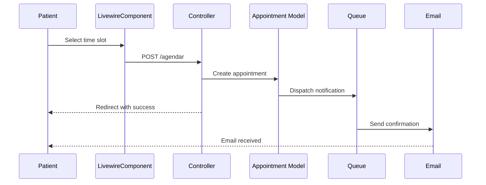

## Architecture Philosophy

NutriFit implements a modern, layered architecture based on the **MVC (Model-View-Controller)** pattern enhanced with the **TALL Stack** (Tailwind CSS, Alpine.js, Laravel, Livewire). This approach ensures:

- **Separation of concerns** between presentation, business logic, and data
- **Reactive UI** without heavy JavaScript frameworks
- **Scalability** through Laravel's robust ecosystem
- **Maintainability** with clear architectural boundaries

## Architectural Layers

### Layer Diagram

```
┌─────────────────────────────────────────────────────────────┐
│                      CAPA DE PRESENTACIÓN                   │
│  ┌──────────────┐  ┌──────────────┐  ┌──────────────┐     │
│  │   Livewire   │  │  TailwindCSS │  │   Flux UI    │     │
│  │  Components  │  │   Utilities  │  │  Components  │     │
│  └──────────────┘  └──────────────┘  └──────────────┘     │
└─────────────────────────────────────────────────────────────┘
                            ▼
┌─────────────────────────────────────────────────────────────┐
│                    CAPA DE APLICACIÓN                       │
│  ┌──────────────┐  ┌──────────────┐  ┌──────────────┐     │
│  │ Controllers  │  │   Actions    │  │  Middleware  │     │
│  │     +        │  │  (Fortify)   │  │     +        │     │
│  │   Requests   │  │              │  │    Rules     │     │
│  └──────────────┘  └──────────────┘  └──────────────┘     │
└─────────────────────────────────────────────────────────────┘
                            ▼
┌─────────────────────────────────────────────────────────────┐
│                     CAPA DE DOMINIO                         │
│  ┌──────────────┐  ┌──────────────┐  ┌──────────────┐     │
│  │    Models    │  │ Notifications│  │   Listeners  │     │
│  │   (Eloquent) │  │   (Queue)    │  │   (Events)   │     │
│  └──────────────┘  └──────────────┘  └──────────────┘     │
└─────────────────────────────────────────────────────────────┘
                            ▼
┌─────────────────────────────────────────────────────────────┐
│                  CAPA DE PERSISTENCIA                       │
│         ┌────────────────────────────────────┐              │
│         │         SQLite / MySQL             │              │
│         │     (Eloquent ORM + Query)         │              │
│         └────────────────────────────────────┘              │
└─────────────────────────────────────────────────────────────┘
```

### 1. Presentation Layer

**Purpose**: Handle user interface and interaction

**Components**:
- **Livewire Components** - Reactive server-side components (`app/Livewire/`)
- **Blade Templates** - View rendering (`resources/views/`)
- **Tailwind CSS** - Utility-first styling
- **Flux UI** - Premium component library for consistent UI

**Location**: `/resources/views/`, `/app/Livewire/`

**Example**:
```php
// app/Livewire/Paciente/AppointmentList.php
class AppointmentList extends Component
{
    public function render()
    {
        return view('livewire.paciente.appointment-list', [
            'appointments' => $this->getAppointments()
        ]);
    }
}
```

### 2. Application Layer

**Purpose**: Orchestrate business logic and handle HTTP requests

**Components**:
- **Controllers** - Handle HTTP requests (`app/Http/Controllers/`)
  - `AdminController.php` - Admin panel operations
  - `NutricionistaController.php` - Nutritionist workflows
  - `PacienteController.php` - Patient operations
  - `AttentionController.php` - Medical attention management
- **Middleware** - Request filtering and authorization
  - Role-based access control
  - Email verification enforcement
  - Password change requirement
- **Fortify Actions** - Authentication workflows (`app/Actions/`)
  - `RedirectAfterLogin.php`
  - `RedirectAfterRegister.php`
  - `RedirectAfterEmailVerification.php`

**Key Routes** (`routes/web.php`):
- `/administrador/*` - Admin panel
- `/nutricionista/*` - Nutritionist dashboard
- `/paciente/*` - Patient portal

### 3. Domain Layer

**Purpose**: Core business logic and domain models

**Components**:

#### Eloquent Models (`app/Models/`)
- `User.php` - User accounts with role-based methods
- `Appointment.php` - Appointment scheduling and state management
- `Attention.php` - Medical consultations
- `AttentionData.php` - Anthropometric measurements and nutrition calculations
- `PersonalData.php` - Patient personal information
- `Role.php` - User roles (administrador, nutricionista, paciente)

#### Notifications (`app/Notifications/`)
16 notification classes handling:
- Welcome emails
- Appointment confirmations
- Reminders (24h before)
- Cancellations
- Password changes

#### Event Listeners (`app/Listeners/`)
- `SendWelcomeNotification.php` - Triggered on user registration

**Business Rules**:
```php
// User state validation
public function estaHabilitadoClinicamente(): bool
{
    return $this->isActive() && $this->hasVerifiedEmail();
}

// Appointment expiration
public function isExpired(): bool
{
    return $this->end_time < now() && 
           $this->appointmentState->name === 'pendiente';
}
```

### 4. Persistence Layer

**Purpose**: Data storage and retrieval

**Database**:
- **Development**: SQLite (embedded)
- **Production**: MySQL 8.0+

**ORM**: Laravel Eloquent
- Active Record pattern
- Relationship management
- Query builder with fluent interface

**Migrations**: Version-controlled schema (`database/migrations/`)

See [Database Schema](/architecture/database-schema) for detailed table structure.

## Key Architectural Components

### Authentication System

**Provider**: Laravel Fortify

**Features**:
- Email/password authentication
- Email verification (required)
- Two-Factor Authentication (2FA)
- Password reset flow
- OAuth integration (Google)

**Implementation**:
```php
class User extends Authenticatable implements MustVerifyEmail
{
    use HasFactory, Notifiable, TwoFactorAuthenticatable;
    
    // Role helpers
    public function isAdmin(): bool
    public function isNutricionista(): bool
    public function isPaciente(): bool
}
```

### Role-Based Access Control (RBAC)

**Roles**:
| Role | ID | Access Pattern |
|------|-----|----------------|
| Administrador | 1 | `/administrador/*` |
| Nutricionista | 2 | `/nutricionista/*` |
| Paciente | 3 | `/paciente/*` |

**Middleware Stack**:
```php
Route::middleware(['auth', 'verified', 'role:nutricionista'])
    ->prefix('nutricionista')
    ->group(function () {
        // Protected routes
    });
```

### Queue System

**Driver**: Database-backed queue (`jobs` table)

**Purpose**:
- Asynchronous email sending
- Preventing HTTP request delays
- Retry failed jobs automatically

**Configuration** (`config/queue.php`):
```php
'default' => env('QUEUE_CONNECTION', 'database'),

'connections' => [
    'database' => [
        'driver' => 'database',
        'table' => 'jobs',
        'queue' => 'default',
        'retry_after' => 90,
    ],
],
```

**Worker Execution**:
```bash
php artisan queue:work
```

See [Notifications System](/architecture/notifications-system) for details.

## Appointment Workflow

The appointment system demonstrates the full stack in action:



**Implementation Flow**:

1. **Presentation**: Livewire component displays available slots
2. **Application**: `PacienteController::storeAppointment()`
3. **Domain**: `Appointment::create()` + validation
4. **Queue**: `AppointmentCreatedForPatientNotification` dispatched
5. **Email**: Sent asynchronously via SMTP

## Configuration Management

**Environment Variables** (`.env`):
```env
APP_NAME="NutriFit"
APP_ENV=production
DB_CONNECTION=mysql
QUEUE_CONNECTION=database
MAIL_MAILER=smtp
```

**Config Files** (`config/`):
- `app.php` - Application settings
- `database.php` - Database connections
- `queue.php` - Queue configuration
- `mail.php` - Email settings
- `fortify.php` - Authentication features

## Development Tools

| Tool | Purpose | Command |
|------|---------|----------|
| **Vite** | Asset bundling + HMR | `npm run dev` |
| **Artisan** | CLI commands | `php artisan serve` |
| **Pest** | Testing framework | `composer test` |
| **Pint** | Code styling (PSR-12) | `./vendor/bin/pint` |
| **Concurrently** | Parallel processes | `composer run dev` |

## Performance Considerations

### Caching Strategy

**Production Optimization**:
```bash
# Cache configuration
php artisan config:cache

# Cache routes
php artisan route:cache

# Cache views
php artisan view:cache

# Optimize autoloader
composer install --optimize-autoloader --no-dev
```

### Database Optimization

**Eager Loading**:
```php
protected $with = ['personalData']; // In User model

// Prevents N+1 queries
$appointments = Appointment::with(['paciente', 'nutricionista'])->get();
```

**Indexes**:
- Foreign keys automatically indexed
- `(nutricionista_id, day_of_week)` composite index on schedules
- Email uniqueness constraint

## Security Architecture

### Data Protection

**Measures**:
- Password hashing (bcrypt)
- CSRF protection (built-in)
- SQL injection prevention (Eloquent)
- XSS protection (Blade escaping)
- Data consent tracking (LOPD compliance)

**User Consent**:
```php
$table->boolean('data_consent')->default(false);
$table->timestamp('data_consent_at')->nullable();
```

### Session Management

Database-backed sessions with:
- IP address tracking
- User agent logging
- Activity timestamps
- Remember token for "stay logged in"

## Scalability Patterns

### Horizontal Scaling Ready

✅ **Stateless application** - Sessions in database  
✅ **Queue-based tasks** - Offloaded to workers  
✅ **Database connection pooling** - MySQL support  
✅ **CDN-ready assets** - Vite manifest for cache busting  

### Future Enhancements

<Warning>
  The following are architectural considerations for future scaling:
  - Redis for caching and queues
  - Read replicas for database
  - Object storage (S3) for profile photos
  - Elasticsearch for patient search
</Warning>

## Next Steps

<CardGroup cols={2}>
  <Card title="Database Schema" icon="database" href="/architecture/database-schema">
    Explore table structures and relationships
  </Card>
  <Card title="TALL Stack Deep Dive" icon="layer-group" href="/architecture/tall-stack">
    How Tailwind, Alpine, Laravel, and Livewire work together
  </Card>
  <Card title="Notifications System" icon="bell" href="/architecture/notifications-system">
    Queue-based email notifications architecture
  </Card>
  <Card title="Getting Started" icon="rocket" href="/installation/quick-setup">
    Set up your development environment
  </Card>
</CardGroup>